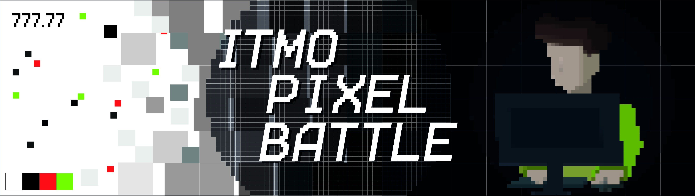
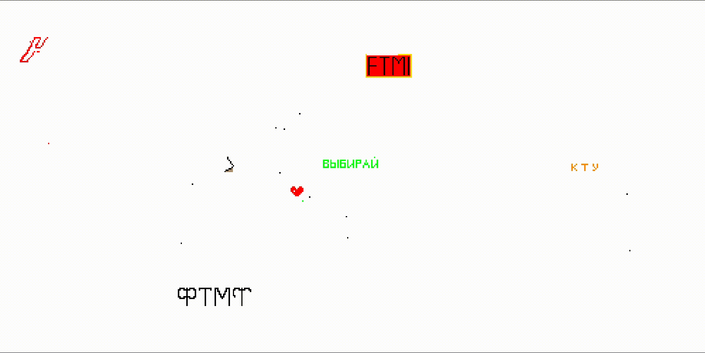
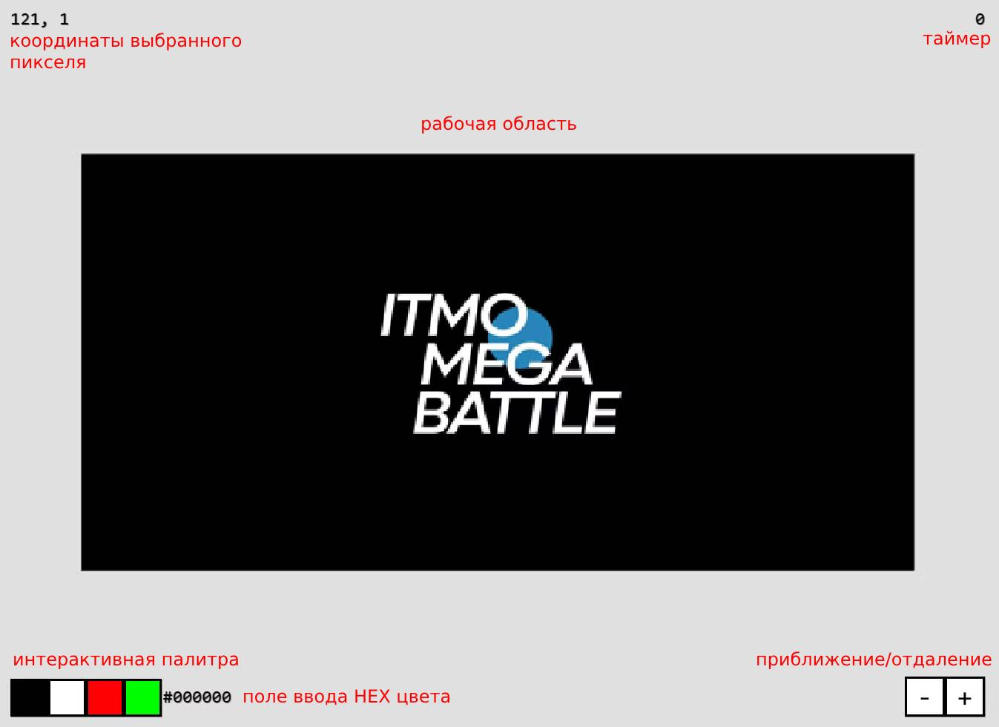
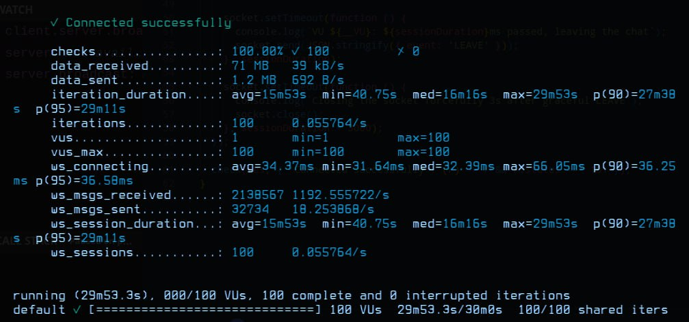

Игра, созданная для студентов университета ИТМО в рамках проекта megabattle. Является социальным экспериментом, представленным в виде полотна, которое может быть изменено юзерами путем постановки разноцветных пикселей. Небольшой реплей с последнего пиксельбатла:

## Контент
1. [Как играть](#как-играть)
2. [Где и когда](#где-и-когда)
3. [Участие в проекте](#участие)
4. [Технический стек](#технический-стек)

## Как играть
- Концепция. Изменяйте полотно, устанавливая разноцветные пиксели в любой точке поля. Выбор цвета осуществляется через палитру или вводом HEX-кода.
- Таймер. Отображается после установки очередного пикселя.
- HEX цвета. Реализована полноценная RGB палитра. Для поиска цветов удобно использовать [color-hex.com](https://www.color-hex.com/).
- Палитра. Для копирования цвета пикселя, который уже установили, зажмите CTRL + ПКМ на этом пикселе.
- Мобилки. Телефоны поддерживаются, для постановки пикселей - тап. Для копирования цвета — удержание пальца на пикселе нужного цвета.

Сейчас проект развернут в тестовом окружении: [ССЫЛКА](https://dev.megapixelbattle.ru/main). Чтобы начать играть, нужно авторизоваться через VK и выбрать свой мегафакультет. После этого будет перенаправление на общее полотно.

## Где и когда
Был впервые запущен в апреле 2024, вернется снова уже в этом октябре. Следите за новостями в группе [мегабаттла](https://vk.com/itmomegabattle)!

## Участие
Если есть идеи/предложения по улучшению работы сервиса, можно написать [мне](https://github.com/vovibssnff) в телеграм или кинуть пул-реквест.

## Технический стек
Бэкенд написан на чистом Go c использованием gorilla/websockets. При нагрузочном тестировании с помощью k6 вебсокет сервер выдержал около 1000 rps.

 Фронтенд - Vue и WebGL. 
 
 Для хранения данных после бенчмарков был выбран редис. Во-первых, ACID становится не столь важен при единственном инстансе сервера (а больше пока что не нужно). Во-вторых, postgres удалось разогнать максимум до инсерта 4k строк в секунду, sqlite - до 66к, редис между ними по скорости. Clickhouse не рассматривался в силу ненадобности использования сложных форматов данных. Таким образом, именно редис стал оптимальным инструментом по скорости и удобству взаимодействия. В нем сохраняется и актуальное состояние полотна, и полная история изменений. 
 
 Есть nginx как api gateway, сервис докеризован. Для авторизации используется VK ID. Реализовано отключение таймера для админов, а также механика бана по ВК. Есть защита от ботов. Идут работы над системой мониторинга (prometheus+grafana), улучшается менеджмент сессий и работа с API VK.
